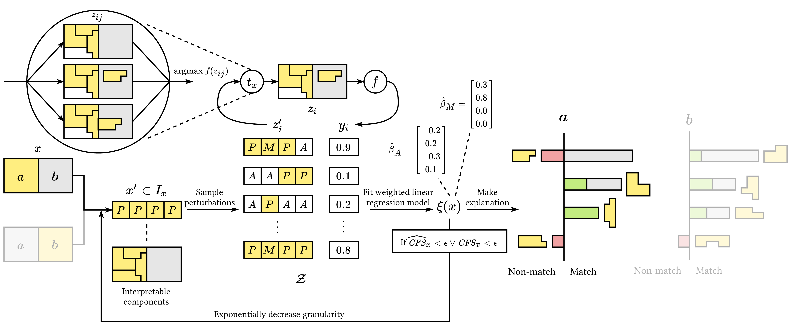
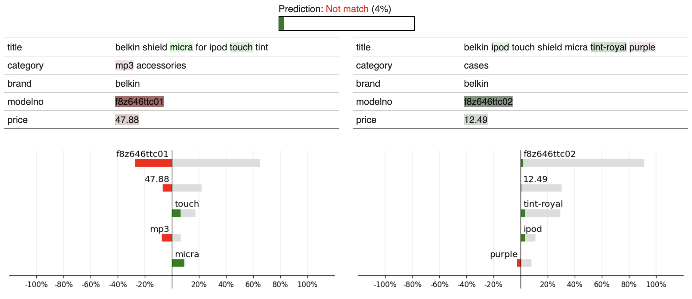

# LEMON: Explainable Entity Matching



LEMON is an explainability method that addresses the unique challenges of explaining entity matching models.


## Installation

```shell
pip install lemon-explain
```
or
```shell
pip install lemon-explain[storage]  # Save and load explanations
pip install lemon-explain[matchers] # To run matchers in lemon.utils
pip install lemon-explain[all]      # All dependencies
```

## Usage

```python
import lemon


# You need a matcher that follows this api:
def predict_proba(records_a, records_b, record_id_pairs):
    ... # predict probabilities / confidence scores
    return proba

exp = lemon.explain(records_a, records_b, record_id_pairs, predict_proba)

# exp can be visualized in a Jupyter notebook or saved to a json file
exp.save("explanation.json")

```
[See the example notebook](https://nbviewer.jupyter.org/github/NilsBarlaug/lemon/blob/main/Example.ipynb)

[](https://colab.research.google.com/github/NilsBarlaug/lemon/blob/main/Example.ipynb)



## Documentation

### lemon.explain()

```
lemon.explain(
    records_a: pd.DataFrame,
    records_b: pd.DataFrame,
    record_id_pairs: pd.DataFrame,
    predict_proba: Callable,
    *,
    num_features: int = 5,
    dual_explanation: bool = True,
    estimate_potential: bool = True,
    granularity: str = "counterfactual",
    num_samples: int = None,
    token_representation: str = "record-bow",
    token_patterns: Union[str, List[str], Dict] = "[^ ]+",
    explain_attrs: bool = False,
    attribution_method: str = "lime",
    show_progress: bool = True,
    random_state: Union[int, np.random.Generator, None] = 0,
    return_dict: bool = None,
) -> Union[MatchingAttributionExplanation, Dict[any, MatchingAttributionExplanation]]:
```

#### Parameters
- **records_a** : pd.DataFrame
  - Records from data source a.
- **records_b** : pd.DataFrame
    - Records from data source b.
- **record_id_pairs** : pd.DataFrame
    - Which record pairs to explain.
      Must be a pd.DataFrame with columns `"a.rid"` and `"b.rid"` that reference the index of `records_a` and `records_b` respectively.
- **predict_proba** : Callable
  - Matcher function that predicts the probability of match.
    Must accept three arguments: `records_a`, `records_b`, and `record_id_pairs`.
    Should return array-like (list, np.ndarray, pd.Series, ...) of floats between 0 and 1 - the predicted probability that a record pair is a match - for all record pairs described by `record_id_pairs` in the same order.
- **num_features** : int, default = 5
  - The number of features to select for the explanation.
- **dual_explanation** : bool, default = True
  - Whether to use dual explanations or not.
- **estimate_potential** : bool, default = True
  - Whether to estimate potential or not.
- **granularity** : {"tokens", "attributes", "counterfactual"}, default = "counterfactual"
  - The granularity of the explanation.
    For more info on `"counterfactual"` granularity see our paper.
- **num_samples** : int, default = None
  - The number of neighborhood samples to use.
    If None a heuristic will automatically pick the number of samples.
- **token_representation** : {"independent", "shared-bow", "record-bow"}, default = "record-bow"
  - Which token representation to use.
    - independent: All tokens are unique.
    - shared-bow: Bag-of-words representation shared across both records
    - record-bow: Bag-of-words representation per individual record
- **token_patterns** : str, List[str], or Dict, default = `"[^ ]+"`
  - Regex patterns for valid tokens in strings.
    A single string will be interpreted as a regex pattern and all strings will be tokenized into non-overlapping matches of this pattern.
    You can specify a list of patterns to tokenize into non-overlapping matches of any pattern.
    For fine-grained control of how different parts of records are tokenized you can provide a dictionary with keys on the format `("a" or "b", attribute_name, "attr" or "val")` and values that are lists of token regex patterns.
- **explain_attrs** : bool, default = False
  - Whether to explain attribution names or not.
    If True, `predict_proba` should accept the keyword argument `attr_strings` - a list that specifies what strings to use as attributes for each prediction.
    Each list element is on the format {("a" or "b", record_column_name): attr_string}.
- **attribution_method** : {"lime", "shap"}, default = False
  - Which underlying method to use contribution estimation.
    Note that in order to use shap `estimate_potential` must be False and the shap package must be installed.
- **show_progress** : bool, default = True
  - Whether to show progress or not. This is passed to `predict_proba` if it accepts this parameter.
- **return_dict** : bool, default = None
  - If True a dictionary of explanations will be returned where the keys are labels from the index of `record_id_pairs`.
    If False a single explanation will be returned (an exception is raised if `len(record_id_pairs) > 1`).
    If None it will return a single explanation if `len(record_id_pairs)` and a dictionary otherwise.

#### Returns
`lemon.MatchingAttributionExplanation` isntance or an `Dict[any, lemon.MatchingAttributionExplanation]`,
depending on the input to the `return_dict` parameter.


### lemon.MatchingAttributionExplanation

#### Attributes
- **record_pair** : pd.DataFrame
- **string_representation** : Dict[Tuple, Union[None, str, TokenizedString]],
- **attributions** : List[Attribution],
- **prediction_score** : float
- **dual** : bool
- **metadata** : Dict[str, any]

#### Methods
- **save(path: str = None) -> Optional[Dict]**
  - Save the explanation to a json file.
    If path is not specified a json-serializable dictionary will be returned.
    Requires pyarrow to be installed (`pip install lemon-explain[storage]`).
- **static load(path: Union[str, Dict]) -> MatchingAttributionExplanation**
  - Load an explanation from a json file.
    Instead of a path, one can instead provide a json-serializable dictionary.
    Requires pyarrow to be installed (`pip install lemon-explain[storage]`).

### lemon.Attribution

#### Attributes
- **weight**: float
- **potential**: Optional[float]
- **positions**: List[Union[Tuple[str, str, str, Optional[int]]]]
- **name**: Optional[str]
